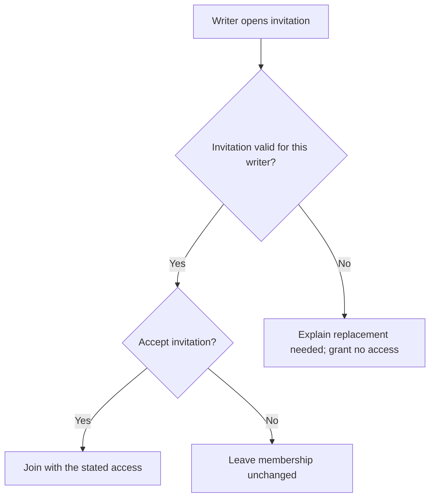

# Invitations

## Purpose And Scope

An invited writer can join or decline a group. Automatic joining and permission
escalation are excluded. [Access control](../system-capabilities/access-control.md)
defines whether the invitation may grant its intended access.

## Requirements And Acceptance

| Requirement reference | Requirement | Priority | Acceptance |
| --- | --- | --- | --- |
| `invite-writers#invitations/FR-001` | A writer can accept or decline a valid invitation; acceptance joins the group and decline leaves membership unchanged. | Must | Check membership after each choice |

## User Journey

**Basis:** Proposed target experience, not observed research. An invited writer
opens an invitation to decide whether to join a group.

| Stage | Action and response | Evidence or assumption | Outcome |
| --- | --- | --- | --- |
| Inspect | Open the invitation and see whether it is valid | Proposed requirement | Writer knows whether joining is possible |
| Decide | Accept or decline a valid invitation | Proposed requirement | Join or retain existing membership |
| Recover | Read why an invalid invitation needs replacing | Shared access requirement | No access granted; obtain another invitation outside this flow |

## User Flow

**Text equivalent:** A valid invitation offers accept or decline. Accept joins the
group with the intended access; decline changes no membership. Invalid invitations
grant no access and explain that a replacement is needed. Obtaining a replacement
is external/manual context, not an added automatic service.

**Coverage:** Accept/decline maps to `invite-writers#invitations/FR-001`. Validity,
intended access, and invalid recovery map to `invite-writers#access-control/FR-001`.

## Assumptions And Risks

No usability research is claimed. Validate that the explanation makes the access
outcome understandable; do not infer usefulness from a diagram parsing successfully.
