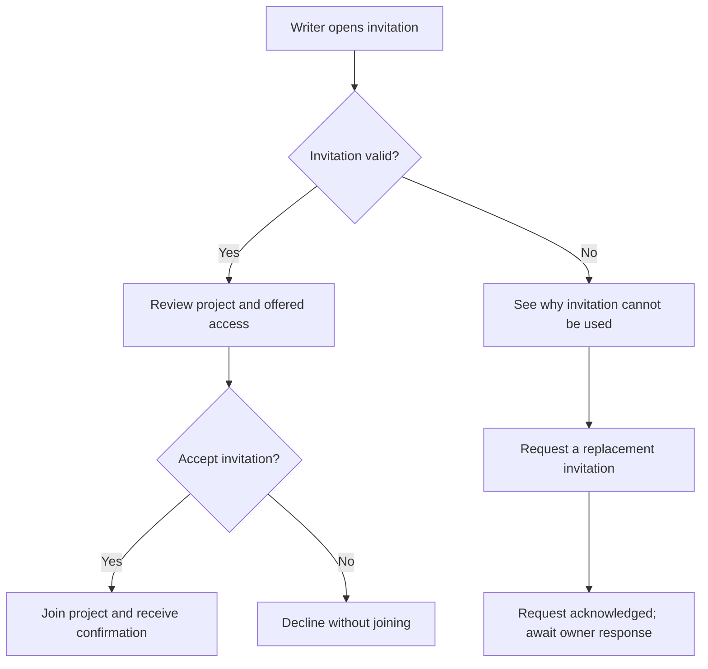

# Example: Joining A Shared Writing Project

This fictional example demonstrates embedded product views. All requirements and
experience claims below are illustrative proposals, not user research, approved
scope, or evidence of delivered functionality. Replace the content for a real PRD.

## User Journeys

### Join A Writing Group

**Basis:** Proposed target experience — unapproved example
**Actor:** An invited writer
**Goal:** Decide whether to participate and enter the shared project if they accept
**Trigger and context:** The writer receives an invitation from a project owner;
the invitation may no longer be valid when opened
**Desired outcome:** The writer joins, declines without joining, or understands how
to request a replacement invitation

| Stage | User goal and action | Touchpoint and product response | Friction or open question | Evidence or assumption | Outcome |
| --- | --- | --- | --- | --- | --- |
| Arrive | Open an invitation | Invitation entry point shows whether the invitation is valid | Could the writer mistake an invalid invitation for rejection by the owner? | Hypothesis; no user research supplied | Writer knows whether they can proceed |
| Evaluate | Understand the project and offered access | Project summary and access information | Is the summary enough to make a decision? | Assumption to explore | Writer can accept or decline |
| Decide | Accept or decline | Acceptance joins the project; declining leaves membership unchanged | No additional behavior is assumed | Proposed product behavior | Writer joins or exits without joining |
| Recover | Request a replacement when the invitation is invalid | Request is acknowledged; owner response is a separate actor's action | No response time is promised | Proposed request behavior; owner response remains external | Writer knows the request is pending |

## User Flows

### Respond To A Project Invitation

**Journey:** [Join a writing group](#join-a-writing-group)
**Basis:** Proposed target experience — unapproved example
**Actor and goal:** Invited writer decides whether to join
**Entry:** Writer opens the invitation; this example assumes no additional sign-in
step is required, which must be confirmed for a real product
**Outcomes:** Joined, declined, or awaiting a replacement invitation

**Text equivalent:** A valid invitation leads to a project/access review and an
accept-or-decline decision. Acceptance joins the project and confirms membership;
declining leaves membership unchanged. An invalid invitation explains the problem
and lets the writer request a replacement. The request is acknowledged, but the
writer is waiting for the owner's response rather than already being a member.

### Illustrative Requirement Coverage

These qualified references represent requirements that would have to exist in a
real PRD set. They are included here in full so this example is self-contained.

| Flow steps or branches | Requirement reference | Proposed requirement and acceptance outcome |
| --- | --- | --- |
| `open`, `valid`, `review` | `invite-writers#invitations/FR-001` | Opening a valid invitation shows the project and offered access before the writer decides |
| `accept` → `joined` | `invite-writers#invitations/FR-002` | Acceptance grants membership and confirms that the writer joined |
| `accept` → `declined` | `invite-writers#invitations/FR-003` | Declining ends the invitation interaction without adding membership |
| `invalid`, `request`, `waiting` | `invite-writers#invitations/FR-004` | An invalid invitation explains why it cannot be used and supports an acknowledged replacement request; acknowledgment does not promise a response time or grant membership |

## Example Reconciliation

If later product learning introduces owner approval before joining, revisit the
Decide stage, the `accept` → `joined` branch, its text equivalent, FR-002, and its
acceptance outcome together. A direct transition to membership would then be stale.
Clarify the new pending/approved/declined behavior with the human before changing
the requirements and flow. Preserve the unaffected invitation-review and recovery
paths unless the revised scope changes them too. Reapprove the complete master
revision rather than updating only its diagram after publication.
