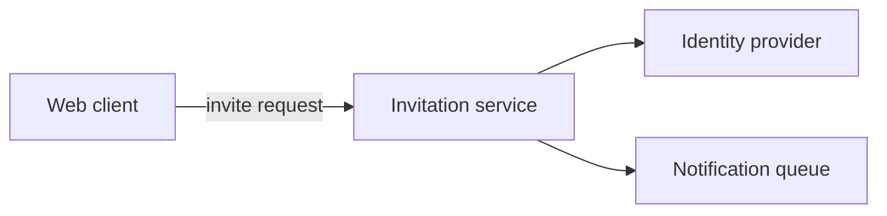

# Architecture Notes

This is the client-neutral contract for working through a technical question with a
human and, when they ask, recording the outcome. It is not an artifact in the delivery
graph and requires no OpenSpec change, product draft, or approved PRD set. Any agent
client can follow this document; the OpenCode adapter exposes it as `/opsx-architect`
and offers it from two points in `/opsx-pm`.

## Inputs And Outputs

- Inputs: a technical question or problem, the human's conversation, the repository,
  and optionally a product draft, an approved PRD set, or an active change as context.
  None of that context is required.
- Output: at most one Markdown note at
  `<planningHome.root>/docs/architecture/<note-id>.md`. A discussion that saves
  nothing is a valid outcome.
- A note is **Exploratory — unapproved**. It is not a `design.md`, an OpenSpec
  artifact, or a published product page, and never enters the PRD-set manifest or any
  approval digest. It selects no delivery work, assigns no requirement IDs, approves
  nothing, and authorizes no code.

## Entry Points

1. `/opsx-architect <note-id> [topic]`, or an equivalent direct request to work through
   architecture. No draft, change, or approval is required.
2. At the end of a product shaping session, offered per `workflows/product-shaping.md`.
3. At the delivery PM handoff, after approval passes and before the engineering handoff.

At points 2 and 3, offer at most once per session. Offer it; never assume it. Silence,
"looks good", or continuing the conversation declines. Do not repeat the offer every
turn, re-offer after a decline in the same session, or make it a condition of ending a
session. Skip the offer entirely when nothing in scope has a technical shape yet, and
ask a better question instead.

> Optional: we can work through the architecture for this — approaches, technologies,
> and trade-offs — and I can record the outcome in `docs/architecture/<note-id>.md`.
> It is exploratory, not a design artifact, an increment, or approval. Want to?

## Enter And Resume

1. Resolve the planning home through `openspec context --json`, with the selected store
   flag when applicable, and use its returned `root.path` as `planningHome.root`.
   Default the note to `<planningHome.root>/docs/architecture/<note-id>.md`. When the
   planning home is a standalone store separate from the repository being designed, ask
   which root should hold the note instead of guessing.
2. Validate `<note-id>` as one lowercase kebab-case path segment matching
   `[a-z0-9]+(-[a-z0-9]+)*`. Reject separators, extensions, absolute paths, `..`, empty
   IDs, and symlinks or paths escaping the resolved directory.
3. Read an existing note in full before continuing it. Reflect back where the
   discussion stopped, including open options and unresolved unknowns, and ask one
   useful next question. Do not restate settled decisions as still open.
4. If no ID was supplied, inspect existing notes and agree on one to resume or on a new
   one. If a specifically requested note is missing, ask before creating a replacement.

## The Discussion

- Take the human's framing and stack as their intent, then check it against the
  repository before reasoning from it. Say when the code disagrees with the
  description, and say when you could not verify a claim.
- Ask one focused question at a time. Identify the decisions the problem actually
  forces rather than surveying the whole system, and start with the one whose answer
  most constrains the rest.
- For each decision, surface more than one approach. Name the technologies, interfaces,
  protocols, and operational constraints each would commit to, and what would have to
  be true for it to work. Prefer options to a single answer; give a recommendation when
  asked and mark it as your view, not a decision.
- Separate what the code already does, what the human has decided, what is an
  assumption, and what is your own suggestion. Never present a preference as settled,
  and never invent benchmarks, costs, throughput, latency, or operational experience.
- Name the unknowns that would decide between approaches, and what would resolve each
  one: a spike, a measurement, an external limit, or a human decision.
- Challenge the framing where the evidence warrants, including whether an existing
  component still fits once a new constraint is added. Do not manufacture disagreement.
- Leave competing options open while the human is still weighing them. For deeper
  free-form codebase investigation, `/opsx-explore` is the existing thinking mode;
  coming back here to record the outcome is fine.
- Offer to save only once the discussion has something worth keeping. The human may
  keep talking, save, or stop with no note at all. A discussion that changes nobody's
  mind is still a successful outcome.

## Writing The Note

When the human asks to save it:

1. Record the technical question, the candidate approaches with their trade-offs, the
   constraints and unknowns that would decide between them, and what would have to be
   true for each to work. Keep rejected options with the human's stated reason rather
   than erasing them.
2. Record `**Status:** Exploratory — unapproved`. When the discussion used a product
   draft, an approved PRD set, or an active change as context, record its path and
   raw-byte SHA-256 for provenance.
3. Write the note as Markdown. Include at least one diagram whenever it describes
   structure or interaction — component boundaries and dependencies, the sequence
   across a transport or process, deployment topology, or lifecycle state. Use a fenced
   `mermaid` block with `flowchart TD`/`flowchart LR`, `sequenceDiagram`, or
   `stateDiagram-v2`, quoted plain-text labels, and a short text equivalent after each
   diagram so the note stays readable unrendered. Check the syntax and say whether
   rendering was also checked. Diagram the approaches being compared rather than a
   settled design; when two approaches differ structurally, give each its own diagram
   instead of blending them. A diagram must not introduce a component, interface, or
   behavior the note's prose does not state.
4. When product intent is in scope, reference the candidate capability or requirement
   headings each approach has to support. If the discussion exposes product behavior
   the draft or PRD set does not cover, raise it as a product question instead of
   settling it here. A note must never add scope the product conversation has not
   agreed.
5. Read existing bytes first, reconcile concurrent human edits, use a staged verified
   replacement, and never report a save that failed.

A compact structural sketch, using the same fictional product as the other examples in
this bundle and carrying no product-specific scope:

Text equivalent: the web client sends an invite request to the invitation service,
which checks the identity provider and enqueues a notification.

## Boundaries

This workflow writes only the selected note and any temporary file needed for its safe
save. It must not create or revise delivery artifacts, scaffold a change, create or
remove an approval, publish product pages, update a product catalog or MkDocs config,
or change application code. Reading an approved product set or an active change as
context grants no edit authority over those records.

A note is evidence for a later `design.md`, which still requires the approved PRD set
and the normal engineering gates. When `design.md` is written it reads any existing
note as prior discussion and carries its approaches and constraints forward; the PRD
set wins wherever they disagree.

If the discussion turns out to need product decisions — who this serves, what outcome
it commits to, what is in or out of scope — say so and route to `/opsx-pm`. Answering a
technical question is not product approval, and a note never selects delivery work.
