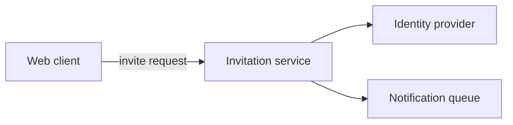

# Product Shaping With A Living PRD Draft

This is the client-neutral contract for exploring a product and maintaining a saved
PRD draft. It runs before, or alongside, delivery planning. It is not an artifact
in the delivery graph and does not require an OpenSpec change. Any agent client can
follow this document; the OpenCode adapter exposes it through `/opsx-pm --shape`.

## Inputs And Outputs

- Inputs: a product topic or existing draft ID, the human's conversation, and the
  selected planning home. The published product overview and indexed pages are optional context.
- Output: one evolving Markdown PRD draft at
  `<planningHome.root>/openspec/product-drafts/<draft-id>.md`.
- Use `templates/product-draft.md` from this same installed schema bundle for a new
  draft. Existing drafts are resumed and revised in place, not replaced by the
  template or copied into a new file for every session.
- Drafts are durable project documents that may be committed and shared. They are
  not ignored local research, published product pages, or engineering commitments. Always
  retain `Mode: product-shaping` and `Status: Draft — unapproved` in the document.
- Neither the draft nor its path belongs in the approved PRD-set manifest. Shaping
  does not require the delivery graph or a format-3 approval.

## Enter And Resume

1. Resolve the selected planning home through `openspec context --json` with the
   selected store flag, when applicable. Use its returned `root.path` as
   `planningHome.root` in this standalone workflow; never silently switch to
   another checkout. Require this workflow and its template to exist in
   that home's installed schema. Stop if the home or contract cannot be resolved.
2. Validate the draft ID as one lowercase kebab-case path segment matching
   `[a-z0-9]+(-[a-z0-9]+)*`. Reject separators, extensions, absolute paths, `..`, empty
   IDs, and symlinks or paths escaping the selected root. Never interpret an ID as
   a change name or write a draft inside `openspec/changes/`.
3. If no ID was supplied, inspect the selected home's existing product drafts and
   ask which one to resume, or agree on a new ID. Do not auto-select a similarly
   named delivery change. If a specifically requested existing draft is missing,
   ask before creating a replacement. A new named shaping session authorizes draft
   creation; a request only to discuss without saving remains conversational.
4. Read an existing draft in full, including open questions, parked ideas, source
   references, and session notes. Reflect back where the discussion stopped and
   ask one useful next question. Keep shaping mode sticky across sessions, even
   if the draft seems complete or an associated delivery change exists.
5. For a new draft, inspect relevant repository product evidence and
   `docs/product/prd.md` and its indexed capability/system-capability pages if present.
   Ask about the product vision or topic, then
   capture what is understood using the template. A partial draft is useful;
   unknown users, outcomes, or capabilities are questions, not blockers to saving.
   Do not invent content just to fill the template.

## Conversation And Drafting

- Explore who the product serves, their problems, desired experience, outcomes,
  possible capabilities, boundaries, alternatives, and unresolved tensions. The
  human controls how long to explore and which area to revisit.
- Ask one focused question at a time when it helps. Reflect and challenge ideas
  constructively; distinguish evidence, user preferences, assumptions, and agent
  suggestions. Do not infer demand, metrics, approval, or commitments.
- No delivery increment, MVP, prioritization matrix, requirement numbering,
  exhaustive capability index, or resolved acceptance criteria is required. Leave
  competing options and material questions open when the human is still exploring.
- Discuss technical feasibility only as relevant product context or a constraint,
  clearly marked as unverified when appropriate. Do not choose architecture,
  technology stacks, APIs, estimates, tasks, or implementation sequences. Record
  engineering questions for later rather than turning them into technical scope.
  The optional architecture note below is the one place those questions may be
  explored as options, and only when the human asks for it; the draft itself stays
  product-level.
- Update the draft after meaningful conversation turns and before pausing. The
  request for a living draft authorizes these incremental saves; do not add a
  repeated approval prompt for every edit. Summarize what changed so the human can
  correct it. A suggested idea stays a suggestion until the human expresses a
  preference; even a preferred direction remains unapproved product intent.
- Keep the PRD cohesive rather than appending a transcript. Preserve unrelated
  sections, human edits, and useful alternatives. Move rejected or parked ideas to
  a short decision note with the human's stated reason, rather than erasing them
  or keeping them as active candidate requirements.
- When the human asks for user journeys or flows, or mapping would clarify the
  experience, follow `workflows/user-journeys.md` in this installed schema and use
  `examples/user-journeys.md` as a fictional example. Embed optional journey tables
  and Mermaid flowcharts in the selected draft, with a text equivalent for each
  flow. Keep evidence and proposed experiences distinct. These views explore product
  behavior without choosing architecture or requiring a delivery increment.
- Revise affected journey stages, flow branches, and candidate capabilities together
  as the conversation develops. Keep unresolved choices explicit, preserve unrelated
  views, and carry the relevant experience into the explicit handoff for human review.
- When the human requests systematic requirements elicitation or quality review,
  including `/opsx-pm --requirements <draft-id>`, follow
  `workflows/requirements-analysis.md` in this installed schema. Keep candidates,
  cross-cutting constraints, and analysis findings in the same living draft. This
  activity remains exploratory product shaping, with no increment or approval.
  On resume, honor the requirements-analysis focus recorded in `Resume Here`;
  returning to broader shaping is also a valid human choice.
- Use `Product Baseline SHA-256` to record the digest of all current product pages:
  overview, README, capability/system-capability Markdown, and `.publication.json`
  if present. Sort planning-root-relative paths bytewise, emit raw file SHA-256,
  two spaces, path, and LF, then hash the UTF-8 manifest; use `absent` for no set.
  Record the path list with the draft's context notes. Do not include dated legacy
  snapshots in the current set. It is a context marker, not approval. Existing
  drafts with `Master Baseline SHA-256` retain that historical marker until their
  overview baseline is checked and the expanded context is reconciled with the human.
  On resume/handoff, compare the complete current set. If it differs, explain drift and reconcile
  affected ideas with the human while preserving draft work. Update the marker only
  after reconciliation; unresolved drift may remain an open question during shaping.
  Never overwrite published product pages to make them match the draft.
- Before saving, re-read the draft and compare it with the bytes read at the start
  of the turn. If someone else edited it, reconcile their edits first; do not overwrite
  them with stale content. Use exclusive creation for a new draft and a staged,
  verified replacement for an existing draft. On a write failure preserve the last
  saved file, report unsaved changes, and do not claim the draft was saved.
- End a session with the draft path, the changes captured, and the next useful
  product question. Staying in shaping mode is a successful outcome. Do not prompt
  for approval or technical planning merely because the template has been filled.
  Offer the optional architecture note below when the draft has enough shape to have
  one; that offer is not a prompt for approval, an increment, or delivery planning.

## Optional Architecture Note

Shaping explores the product; it does not choose an implementation. Some humans want
to work through the technical shape next rather than move straight on. This step is
shared by two offer points, and is offered at most once per session:

- At the end of a shaping session, after the draft path and the next product question.
- At the delivery PM handoff, once approval passes and before the engineering handoff.

> Optional: we can work through the architecture for this — approaches, technologies,
> and trade-offs — and I can record the outcome in `docs/architecture/<note-id>.md`.
> It is exploratory, not a design artifact, an increment, or approval. Want to?

Offer it; never assume it. Silence, "looks good", or continuing the product
conversation declines. Do not repeat the offer every turn, re-offer after a decline
in the same session, or make it a condition of ending a session. Staying in shaping
with no note is a successful outcome. Skip the offer when the draft has no candidate
capability or boundary with a technical shape yet, and ask a product question instead.

When the human accepts, discuss before writing anything:

- Work through the technical question the way shaping works through product: ask one
  focused question at a time, surface more than one approach, and name the
  technologies, interfaces, and operational constraints each approach would commit
  to. Ground the options in the repository rather than in theory.
- Separate what the code already does, what the human has decided, what is an
  assumption, and what is your own suggestion. Never present a preference as a
  settled choice or invent benchmarks, costs, throughput, or operational experience.
- Leave competing options open while the human is still weighing them. For deeper
  free-form investigation, `/opsx-explore` is the existing thinking mode; coming back
  here to record the outcome is fine.
- Offer to save only once the discussion has something worth keeping. The human may
  keep talking, save, or stop with no note at all. A discussion that changes nobody's
  mind is still a successful outcome.

When the human asks to save it:

1. Resolve the destination before writing. Default to
   `<planningHome.root>/docs/architecture/<note-id>.md`. When the planning home is a
   standalone store separate from the repository being designed, ask which root
   should hold the note instead of guessing. Validate `<note-id>` with the draft-ID
   rules above and never write outside the resolved directory.
2. Record the source draft path, its raw-byte SHA-256, and
   `**Status:** Exploratory — unapproved`. A note is not a `design.md`, an OpenSpec
   artifact, or a published product page, and never enters the PRD-set manifest or
   any approval digest.
3. Describe the technical question, the candidate approaches with their trade-offs,
   the constraints and unknowns that would decide between them, and what would have
   to be true for each to work. Prefer options to a single answer; give a
   recommendation only when asked, and mark it as the agent's view, not a decision.
4. Write the note as Markdown. Include at least one diagram whenever it describes
   structure or interaction — component boundaries and dependencies, the sequence
   across a transport or process, deployment topology, or lifecycle state. Use a
   fenced `mermaid` block with `flowchart TD`/`flowchart LR`, `sequenceDiagram`, or
   `stateDiagram-v2`, quoted plain-text labels, and a short text equivalent after
   each diagram so the note stays readable unrendered. Check the syntax and say
   whether rendering was also checked. Diagram the approaches being compared rather
   than a settled design; when two approaches differ structurally, give each its own
   diagram instead of blending them. A diagram must not introduce a component,
   interface, or behavior the note's prose does not state.
5. Reference the candidate capability or requirement headings each approach has to
   support. If the note exposes product behavior the draft does not cover, raise it
   as a product question and revise the draft with the human. A note must never add
   scope the product conversation has not agreed.
6. Read existing bytes first, reconcile concurrent human edits, use a staged verified
   replacement, and never report a save that failed.

A compact structural sketch, using the same fictional product as the other examples
in this bundle and carrying no product-specific scope:

Text equivalent: the web client sends an invite request to the invitation service,
which checks the identity provider and enqueues a notification.

A note selects no delivery work, assigns no requirement IDs, approves nothing, and
authorizes no code. It is evidence for a later `design.md`, which still requires the
approved PRD set and the normal engineering gates. When the draft or the note changes
so that they disagree, raise it with the human rather than silently rewriting either.

## Boundaries And Explicit Handoff

Shaping writes only the selected draft, an accepted architecture note, and any
temporary file needed for their safe save. It must not create or revise delivery
artifacts, remove an existing approval, publish product pages, update a product
catalog/MkDocs config, or change application code.
Opening an approved product or an active change as context grants no edit authority
over those records. A draft may remain unfinished indefinitely.

"Looks good", "save it", accepting an idea, and continuing the conversation are
not a mode switch or product approval. If "approve" is ambiguous, ask whether the
human is expressing a product preference or requesting the formal approval workflow.
Record a preference in the draft without creating a product-approval record.

Only when the human explicitly requests delivery scoping, or uses
`/opsx-pm --from-draft <draft-id>`, begin the normal product-brief conversation:

1. Require the named draft to exist, validate its path, and read its latest bytes
   and the current published product set. Resolve material baseline drift with the human.
2. Ask which candidate outcomes/capabilities belong in the next increment and
   which remain exploratory. A switch into scoping is not agreement to build the
   whole draft, approval to create a change, or approval to publish it.
   If candidate requirements or analysis findings exist, follow the explicit
   delivery handoff in `workflows/requirements-analysis.md`: review selected
   behaviors, relevant shared constraints, dependencies, evidence, and open findings.
   Map selected candidate headings to formal IDs only in the detailed increment
   PRDs; keep unselected candidates unapproved. A completed requirements review is
   neither required for scoping nor approval of the increment.
3. Follow the existing product-brief and PRD review gates. Include the source draft
   path and raw-byte SHA-256 in the product brief for provenance, and capture the
   selected intent in the change-scoped PRDs. Later draft edits do not silently
   change that increment or invalidate its approval; changes to approved intent go
   through the normal revision and reapproval procedure.
4. Prepare the complete multi-file product candidate and publication plan against
   the current published set using only the reviewed increment. Follow
   `workflows/product-publication.md`; do not import exploratory candidates wholesale.
   Explicit format-3 approval permits delivery, with reapproval for later changes;
   archive publishes the reconciled pages and navigation. Engineering planning and
   implementation remain separate explicit actions.
5. Leave the exploratory draft available for further thinking. It remains
   `Draft — unapproved` after a handoff. Return to shaping whenever the human asks,
   preserving existing delivery artifacts and approval records.

If the human requests formal product approval without choosing delivery work,
clarify what product scope they want to approve before entering the existing approval
workflow. Saving or endorsing an exploratory draft alone never performs publication.
